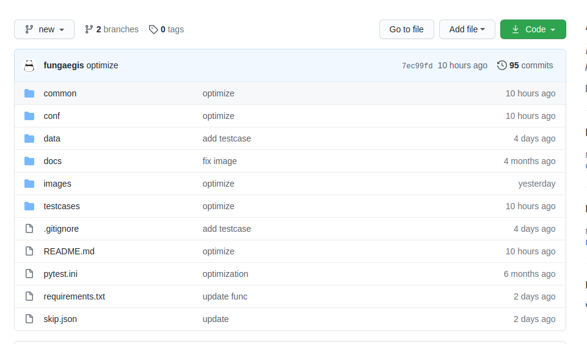
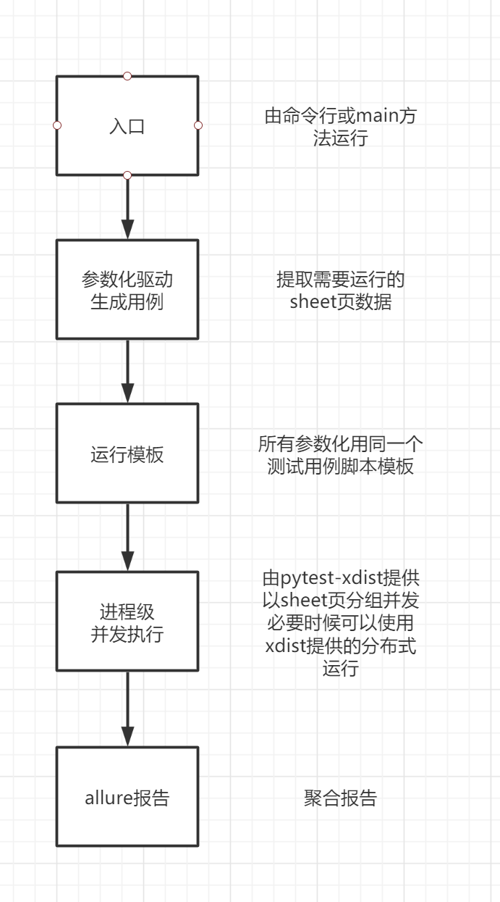

# 目录
- [说明](#说明)
- [功能说明](#功能说明)
- [目录结构](#目录结构)
- [启动参数](#启动参数)
- [最佳实践](#最佳实践)
- [生成测试报告](#生成测试报告)
- [用例运行顺序](#用例运行顺序)
- [用例模板参数](#用例模板参数)
- [用例模板DEMO](#用例模板DEMO)
- [用例语法规则](#用例语法规则)
- [配置介绍](#配置介绍)
  - [参数介绍](#参数介绍)
- [标记配置](#标记配置)
- [注意事项](#注意事项)
- [更新日志](#更新日志)

## 说明
本版本为stable版本,dev版本因调试存在敏感信息及本人原因存在较多无意义的commit记录.故在此独立项目开源stable版本.如有任何关于框架的疑问都可以提issue


## 功能说明
1. 支持以excel作为用例数据源,便于测试人员编写测试用例
2. 支持存在用例依赖(后序用例依赖前序用例)的场景测试,也支持单接口测试用例(无依赖)
3. 采用参数化驱动+测试用例代码模板,无论多少用例都是使用同一个用例代码模板,非常方便日后的维护和优化
4. 完美兼容pytest的命令及其他插件,如allure,pytest-xdist等
5. 搭配pytest-xdist的loadscope负载策略和pytest-custom-nodeid的自定义nodeid,支持实现以sheet为单位的进程级并发运行和分布式运行
6. 搭配pytest-custom-nodeid支持在场景测试用例的并发运行时,前序用例失败 后续用例全部跳过的功能,避免后续用例无谓执行(存在依赖,后序用例必然失败)
7. 在并发运行时,不支持使用`pytest -x`命令,使用后任一用例失败将导致全部用例停止运行,程序停止
8. 使用pytest-xdist的`-n=auto`会根据sheet数量,运行数量相等的进程
9. 支持共享前置数据
   - 在配置中设置需要共享数据的前置用例sheet,运行后将用例中提取的参数共享给全部用例组使用.key跟提取命名一致
## 目录结构
```
├── README.md
├── images
├── requirements.txt
├── pytest.ini
├── skip.json
├── common
│	├── case_base.py
│	├── constant.py
│	├── context.py
│	├── hook_func.py
│	├── http_request.py
│	├── logger.py
│	├── mysql_data.py
│	├── read_excel.py
│	├── record.py
│	├── send_email.py
│	└── utils.py
├── conf
│	├── mark.json
│	└── config.json
├── data
│	└── cases.xlsx
├── docs
├── logs
├── reports
└── testcases
```
## 启动参数
`pytest -E=ENV -P=PRODUCT -S=EXCEL_SHEET_NAME1 -S=EXCEL_SHEET_NAME2 --mark=MARK_NAME`
- -E --env: 用于选择conf/config.json配置文件中的环境,需要与环境key相等,默认为test
- -P --product: 用于选择conf/config.json配置文件中的产品线,需要与产品线key相等
- -S --sheet: 用于选择执行的excel sheet页.支持多选
- --mark: 用于选择在conf/mark.json中被标记的sheet页面, 可与`-S`一起使用,执行结果为合集

## 最佳实践
需要搭配 [pytest-custom-nodeid](https://github.com/fungaegis/pytest-custom-nodeid) 和pytest-xdist使用

以便支持以sheet页名字进行分组,以title名作为测试用例名,并且支持分组并发等

`pytest -E=ENV -P=PRODUCT -S=EXCEL_SHEET_NAME1 -S=EXCEL_SHEET_NAME2 --mark=MARK_NAME
-n=auto --dist=loadscope 
--rename=on --skip=EXCEL_SHEET_NAME1 
--alluredir=../reports/allure-result`

- `-n`: 如果为具体数字,则开启对应数字的进程数,如果为`auto`则开启需要运行的sheet页面数的进程
- `--dist`: 开启以sheet页面为组的并发模式
- `--rename`: 开启修改nodeid模式,搭配这个才能进行分组并发
- `--skip`: 组内前序用例失败,后续全部跳过,用于存在用例数据依赖的测试场景使用
- `--alluredir`: allure 报告数据输出地址

## 生成测试报告
`allure generate reports/allure-results -c -o reports/allure-report`

## 用例运行顺序
1. 强制等待时间: 
2. 前置执行sql
3. 发送接口请求
4. 接口层面断言
5. 提取数据
6. 数据库层面断言
7. 后置执行sql


## 用例模板参数

|title|说明|备注|示例|
|  ----  | ----  |  ----  | ----  |
|id|运行顺序|建议以升序的形式编写用例(从上到下)||
|event|事件|程序不使用,仅供编写者归总使用||
|title|用例名||
|use|开关(1/0)|关闭时用例跳过不执行|
|method|请求方法|暂只支持get/post|
|service|服务端|在./conf/config.json文件中service配置|
|api|接口path|用于与service拼接成完整url|
|data_type|数据类型|目前支持json/file(file为文件上传)|
|request_header|请求头|json格式|
|request_body|请求体,json格式|当data_type为file的格式其中file_name和file_param不可变,默认读取./docs目录内的文件,直接填写文件名即可|上传格式:{"file_name":"images.png","file_param": {"use_type": "SalaryImg"}}|
|expected_header|预期响应头|json格式|
|expected_body|预期响应体|json格式|
|assertion_headers_path|断言响应头的jsonpath|以列表形式展示,支持多个断言|['$.success', '$.data[0].product_name']|
|assertion_body_path|断言响应体的jsonpath|以列表形式展示,支持多个断言|同上|
|extract_path|提取参数{"参数名":"提取的jsonpath"}|以字典的形式展示,支持多个提取|{"app_account_id": "$.data.account_id", "app_token": "$.data.token"}|
|sleep|强制休息时间(s)|用在用例运行之前强制休息|
|wait_times|轮询次数|默认为60次|每次等待6秒|
|wait_path|轮询等待的jsonpath|||
|setup_sql|前置sql|用于在请求之前初始化环境|暂只支持执行,不可读取及提取返回值|
|teardown_sql|后置sql|用于在请求之后运行|暂只支持执行,不可读取及提取返回值|
|check_sql|检查sql,仅可读取一个字段|用于断言数据层||
|assertion_sql_value|字符串,与check_sql查询数据断言|||
|remarks|备注|仅供编写人员使用|

## 用例模板DEMO
[cases.xlsx](./data/cases.xlsx)

## 用例语法规则

|格式|描述|
|---|---|
|\*var\*|"*"表示变量var需要生成（需要在脚本提前生成方法)|
|#var#|"#"表示变量var可以引用提取参数的值,配置文件的值|

common.utils.Utils类用于存放共用的需要进行生成数据操作的方法.

单项目非共用方法,可直接继承Utils类,在该类下编写需要进行生成数据操作的方法

`*var*`在excel的用例模板中var为Utils子类和父类的方法名.

## 配置介绍
文件名不可变,必须为 config.json

### 参数介绍

- 产品线: 该key为命令`-P`指定的名字,大小写敏感
  - file: 测试用例数据源文件,该文件必须放在./data目录内
  - utils: 指定该产品线要用的工具类,该工具类必须在common.utils模块内且value与类名一致
  - product: 产品线全称,可不要
  - init: 需要在初始化运行的sheet页,仅会运行一次.为空不运行
  - env: env对象下存放每个环境的配置
    - 环境1
      - service: 存放不同服务端的path
      - log: 日志配置
      - mysql: 数据库配置
      - data: 用例中`#变量#`会在context(提取参数)无法找到时,读取此处的配置.用于存放固定配置
  
```json
{
  "产品线1简称": {
    "product": "产品线全称",
    "file": "cases1.xlsx",
    "utils": "产品线1Utils",
    "init": "init",
    "env": {
      "dev": {
        "service": {
          "app": "http://192.16.16.55:4444",
          "web": "http://192.16.16.55:5555"
        },
        "log": {
          "logger_level": "DEBUG",
          "stream_level": "DEBUG",
          "file_level": "INFO",
          "file_level_rf": "INFO"
        },
        "mysql": {
          "host": "192.16.16.55",
          "port": "3306",
          "user": "admin",
          "password": "admin"
        },
        "data": {
          "web_user": "asdsa@asdd.ccc",
          "web_pwd": "584ac7e1e756e261b"
        }
      },
      "test": {
        "service": {
          "app": "http://192.16.16.40:4444",
          "web": "http://192.16.16.40:5555"
        },
        "log": {
          "logger_level": "DEBUG",
          "stream_level": "DEBUG",
          "file_level": "INFO",
          "file_level_rf": "INFO"
        },
        "mysql": {
          "host": "192.16.16.99",
          "port": "3306",
          "user": "admin",
          "password": "admin"
        },
        "data": {
          "web_user": "api@dsglj.ccc",
          "web_pwd": "584ac7e1e7f61b"
        }
      }
    }
  },
  "产品线2简称": {
    "product": "产品线2",
    "file": "cases2.xlsx",
    "utils": "产品线2Utils",
    "init": "init",
    "env": {
      "dev": {
        "service": {
          "app": "http://192.16.16.22:4444",
          "web": "http://192.16.16.22:5555"
        },
        "log": {
          "logger_level": "DEBUG",
          "stream_level": "DEBUG",
          "file_level": "INFO",
          "file_level_rf": "INFO"
        },
        "mysql": {
          "host": "192.16.16.22",
          "port": "3306",
          "user": "admin",
          "password": "admin"
        },
        "data": {
          "web_user": "asdsa@asddas.ccc",
          "web_pwd": "584ac7e1e89f52061b"
        }
      },
      "test": {
        "service": {
          "app": "http://192.16.16.22:4444",
          "web": "http://192.16.16.22:5555"
        },
        "log": {
          "logger_level": "DEBUG",
          "stream_level": "DEBUG",
          "file_level": "INFO",
          "file_level_rf": "INFO"
        },
        "mysql": {
          "host": "192.16.16.22",
          "port": "3306",
          "user": "admin",
          "password": "admin"
        },
        "data": {
          "web_user": "api@dsgklj.ccc",
          "web_pwd": "584ac7e1e89f52061b"
        }
      }
    }
  }
}
```
## 标记配置
文件名不可变,必须为mark.json,必须放在conf目录内

- 产品线简称: 必须与config.json中的简称一致
  - mark: 标注名,以数组格式存储该用例集的sheet页面名

```json
{
  "G": {
    "smoke": [
      "smoke",
      "login"
    ],
    "login": [
      "login"
    ]
  },
  "C": {
    "smoke": [
      "smoke",
      "login"
    ],
    "login": [
      "login"
    ]
  }
}
```

## 注意事项
本框架的jsonpath,如需找最后一个需要以此格式`$.data[(@.length-1)]`

## 更新日志
### v1.0
框架正式开源

### v1.1
1. 对读取文件增加文件锁,避免在并发状态下出现互抢文件句柄
2. 增加前置数据共享(如:前置登录获取token,共享给所有进程使用)

### v1.2
1. 修复了在不开启pytest-xdist并发运行时的错误